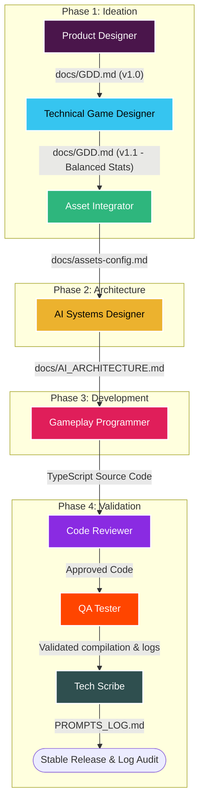

# AI Operations Manual: Sequential Crew Workflow Pipeline

This document defines the official operations manual for the AI crew in **NebriGame / Dino-Clash**. It details our specialised agents, tactical skills, and establishes a strict, sequential 4-phase assembly line pipeline to guarantee mathematical balance, seamless code integration, strict typing, and comprehensive auditability.

---

## 1. AI Crew Members (Agents)

Our crew consists of 8 autonomous agents, each designated to a specific operational layer and specialized task.

| Agent Profile | Layer | Primary Mission |
| :--- | :--- | :--- |
| **[Product Designer](../agents/product-designer.md)** | Management & Definition | Writes and maintains the Game Design Document (`GDD.md`). Defines character health, weapons, and betrayal mechanics. Does not write code. |
| **[Technical Game Designer](../agents/technical-game-designer.md)** | Balance & Mathematics | Balances numerical variables (damage, speed, map sizes, distances) to ensure absolute mathematical consistency. |
| **[Asset Integrator](../agents/asset-integrator.md)** | Asset Mapping | Maps pixel art resources from Itch.io and defines animation frame rates and coordinates (idle, run, jump, kick, hurt). |
| **[AI Systems Designer](../agents/ai-systems-designer.md)** | Architecture & AI | Designs the cognitive architecture (FSM, Utility AI) for the 3 NPC dinosaurs and controls the betrayal mechanic (Loyal, Doubtful, Hostile). |
| **[Gameplay Programmer](../agents/gameplay-programmer.md)** | Core Development | Writes clean, robust code in Phaser 4 and TypeScript. Programs the game loop, Smash Bros-style Arcade Physics, and input capturing. |
| **[Code Reviewer](../agents/code-reviewer.md)** | Quality Assurance Gate | Acts as a quality filter. Evaluates TypeScript code against the `GDD.md` and Phaser 4 specifications. Rejects poorly typed code. |
| **[QA Tester](../agents/qa-tester.md)** | Compile & Bug Patching | Monitors Vite and TypeScript compiler terminals. Detects and resolves issues (Vibe Coding) by patching code without human intervention. |
| **[Tech Scribe](../agents/tech-scribe.md)** | Traceability & Auditing | Acts as an auditor. Automatically records every prompt, model, tokens, and results in `PROMPTS_LOG.md` to ensure session traceability. |

---

## 2. Tactical Capabilities (Skills)

These core guidelines and mathematical frameworks empower our agents to maintain high code standards, predictable logic, and strict traceability.

*   **[Spatial Calculation](../skills/spatial-calculation.md)**: Establishes mathematical methodologies and spatial AI algorithms to enable Non-Player Characters (NPCs) to analyze their environment, trace lines of sight, and make safe, predictive navigation decisions.
*   **[Semantic Commits](../skills/semantic-commits.md)**: Standardizes version control in the repository by consistently using defined semantic prefixes for every autonomous commit made by the AI.
*   **[Phaser & TypeScript](../skills/phaser-typescript.md)**: Establishes development guidelines using Phaser 4 and TypeScript syntax to guarantee code modularity, proper scene lifecycle management, and strict object-oriented typing.
*   **[Finite State Machine AI](../skills/fsm-ai.md)**: Defines a logical architecture based on Finite State Machines (FSM) to control the game round flow predictably and manage behavior and loyalty state transitions for allied NPCs.
*   **[Defensive Programming](../skills/defensive-programming.md)**: Establishes guidelines to prevent catastrophic failures and unhandled runtime exceptions by validating the state and existence of entities in memory before any interaction.
*   **[Auto-Documentation](../skills/auto-documentation.md)**: Guarantees developmental traceability and session auditing through the automated interception and logging of every interaction within the environment.
*   **[Arcade Physics](../skills/arcade-physics.md)**: Defines guidelines for the advanced usage of Phaser's Arcade Physics engine, focusing on precise AABB collision management, instant velocity manipulation, and clean physical entity destruction.

---

## 3. The 4-Phase Sequential Assembly Line Pipeline

The development process operates as a sequential pipeline where output deliverables from one agent serve as the mandatory input specifications for the next. This flow is structured across 4 distinct phases: **Ideation**, **Architecture**, **Development**, and **Validation**.

### Pipeline Flowchart

---

## 4. Phase-by-Phase Technical Breakdown

### Phase 1: Ideation

This phase establishes the foundational gameplay rules, mathematical balance, and asset mappings before a single line of game logic is coded.

#### Step 1.1: Feature & Combat Specs Definition
*   **Active Agent:** [Product Designer](../agents/product-designer.md)
*   **Input Received:** `USER_REQUEST` (Initial design requirements, mechanics, character requests).
*   **Deliverable Produced:** `docs/GDD.md` (v1.0 - Gameplay specs, rules, weapons, betrayal state definitions).
*   **Transmitted To:** [Technical Game Designer](../agents/technical-game-designer.md)

#### Step 1.2: Numerical Balancing & Formulas
*   **Active Agent:** [Technical Game Designer](../agents/technical-game-designer.md)
*   **Input Received:** `docs/GDD.md` (v1.0)
*   **Deliverable Produced:** `docs/GDD.md` (v1.1 - Updated GDD containing mathematically derived speeds, friction coefficients, damage curves, knockback values, and health thresholds).
*   **Transmitted To:** [Asset Integrator](../agents/asset-integrator.md)

#### Step 1.3: Visual Asset Mapping
*   **Active Agent:** [Asset Integrator](../agents/asset-integrator.md)
*   **Input Received:** `docs/GDD.md` (v1.1) and raw sprite assets (from Itch.io or local assets directory).
*   **Deliverable Produced:** `docs/assets-config.md` (Detailed mapping of sprite files, frame numbers, texture keys, width/height offsets, frame rates, and animation lists: Idle, Run, Jump, Kick, Hurt, Betrayal).
*   **Transmitted To:** [AI Systems Designer](../agents/ai-systems-designer.md)

---

### Phase 2: Architecture

Translates game guidelines and asset dimensions into strict mathematical algorithms and state machines.

#### Step 2.1: Cognitive & Spatial Blueprinting
*   **Active Agent:** [AI Systems Designer](../agents/ai-systems-designer.md)
*   **Input Received:** `docs/GDD.md` (v1.1) and `docs/assets-config.md`.
*   **Deliverable Produced:** `docs/AI_ARCHITECTURE.md` (Finite State Machine schemas for dinosaur NPCs, state transition triggers for *Loyal*, *Doubtful*, and *Hostile* states, raycasting algorithms for spatial line-of-sight tracking, and pathing math).
*   **Transmitted To:** [Gameplay Programmer](../agents/gameplay-programmer.md)
*   **Applied Skills:** [Finite State Machine AI](../skills/fsm-ai.md), [Spatial Calculation](../skills/spatial-calculation.md)

---

### Phase 3: Development

Transforms blueprints, textures, and equations into a modular, strictly-typed playable game client.

#### Step 3.1: Core System Coding
*   **Active Agent:** [Gameplay Programmer](../agents/gameplay-programmer.md)
*   **Input Received:** `docs/GDD.md` (v1.1), `docs/assets-config.md`, and `docs/AI_ARCHITECTURE.md`.
*   **Deliverable Produced:** TypeScript Source Code (`src/scenes/*.ts`, `src/entities/*.ts`, `src/physics/*.ts`, `src/main.ts`) featuring physical platforms, Smash-style combat mechanics, keyboard/gamepad inputs, and interactive companion FSM.
*   **Transmitted To:** [Code Reviewer](../agents/code-reviewer.md)
*   **Applied Skills:** [Phaser & TypeScript](../skills/phaser-typescript.md), [Arcade Physics](../skills/arcade-physics.md), [Defensive Programming](../skills/defensive-programming.md)

---

### Phase 4: Validation

Ensures extreme stability, type safety, optimal runtime performance, and logs developmental traceability.

#### Step 4.1: Static Code Review & Compliance
*   **Active Agent:** [Code Reviewer](../agents/code-reviewer.md)
*   **Input Received:** TypeScript Source Code files (`src/**/*.ts`) and GDD specifications.
*   **Deliverable Produced:** `docs/CODE_REVIEW_REPORT.md` (Approval checklist showing compliance with strict typing, Phaser 4 lifecycle structure, object orientation, and GDD guidelines. If validation fails, code is rejected back to the Gameplay Programmer).
*   **Transmitted To:** [QA Tester](../agents/qa-tester.md)
*   **Applied Skills:** [Phaser & TypeScript](../skills/phaser-typescript.md)

#### Step 4.2: Compilation Monitoring & Bug Fixing
*   **Active Agent:** [QA Tester](../agents/qa-tester.md)
*   **Input Received:** Approved Source Code and compiler outputs from terminal (Vite / TypeScript Compiler).
*   **Deliverable Produced:** Stable debugged source code (Immediate hot-patch fixes for any compilation warning or runtime console error detected via compiler telemetry).
*   **Transmitted To:** [Tech Scribe](../agents/tech-scribe.md)
*   **Applied Skills:** [Defensive Programming](../skills/defensive-programming.md)

#### Step 4.3: Interception & Session Auditing
*   **Active Agent:** [Tech Scribe](../agents/tech-scribe.md)
*   **Input Received:** Stable codebase, developer terminal outputs, history of interactive prompts and model parameters.
*   **Deliverable Produced:** `PROMPTS_LOG.md` (Updated compilation of agent prompts, active models used, token consumption metrics, and final commit SHAs for full transparency).
*   **Transmitted To:** Version Control System (Release)
*   **Applied Skills:** [Auto-Documentation](../skills/auto-documentation.md), [Semantic Commits](../skills/semantic-commits.md)

---

## 5. Cross-Cutting Execution Principles

> [!IMPORTANT]
> **Strict Sequence Compliance**: No development work (Phase 3) should start until both the mathematical values and assets are documented in Ideation (Phase 1) and mapped in Architecture (Phase 2).

> [!TIP]
> **Continuous Auditing**: Every agent commit must follow the [Semantic Commits](../skills/semantic-commits.md) format strictly, so that the [Tech Scribe](../agents/tech-scribe.md) can trace git tags smoothly during the audit phase.

> [!WARNING]
> **Zero Unhandled Exceptions**: The Gameplay Programmer and QA Tester must validate entity bounds and presence in memory under [Defensive Programming](../skills/defensive-programming.md) constraints before passing files to the Code Reviewer.
